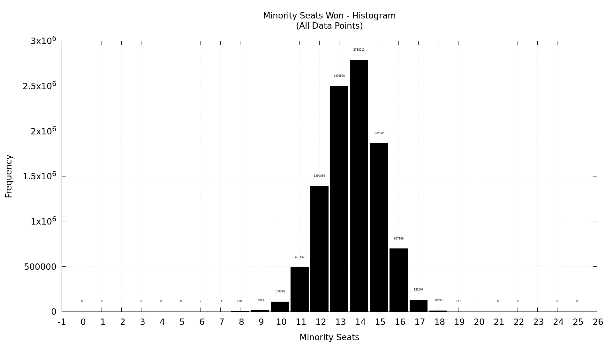
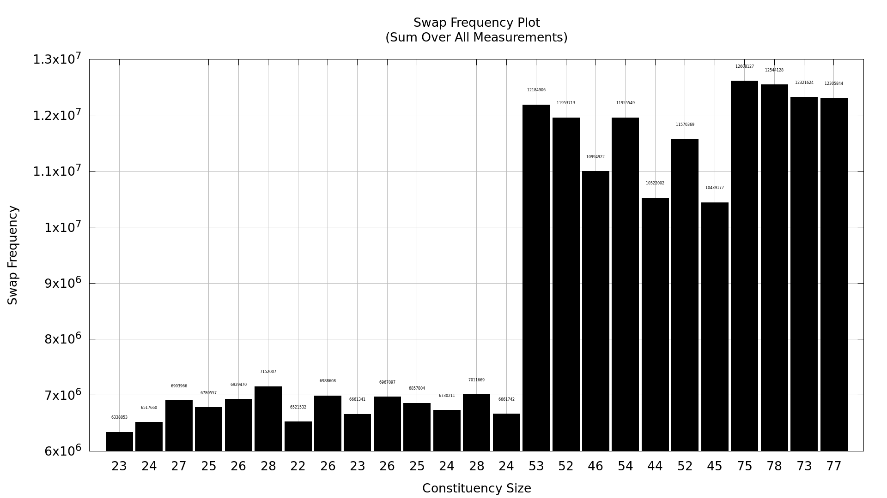
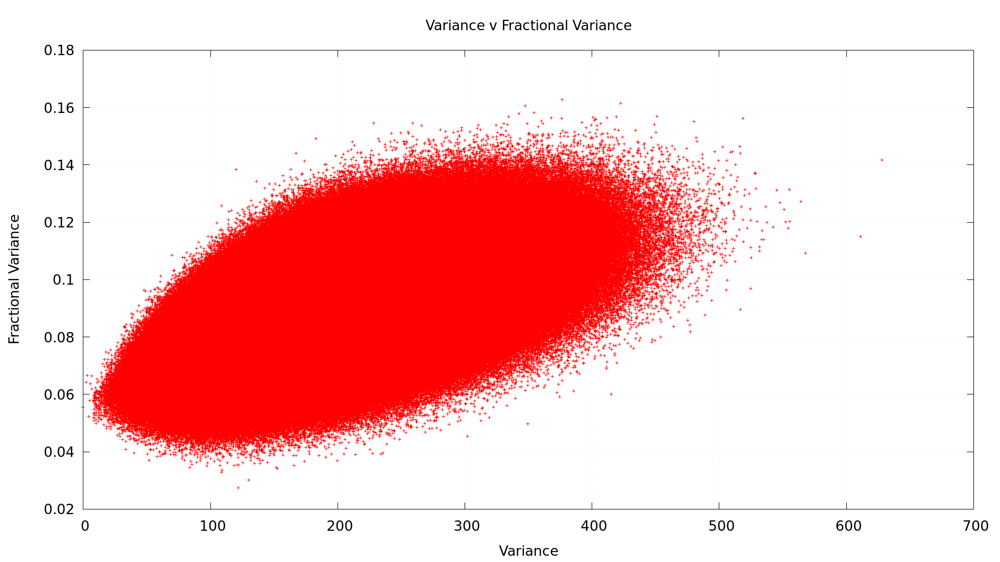
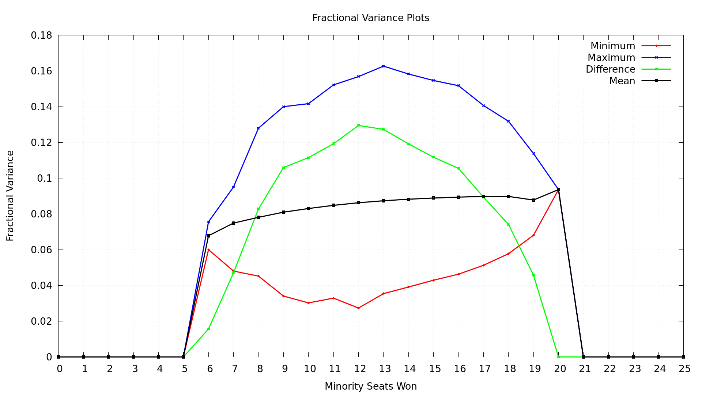
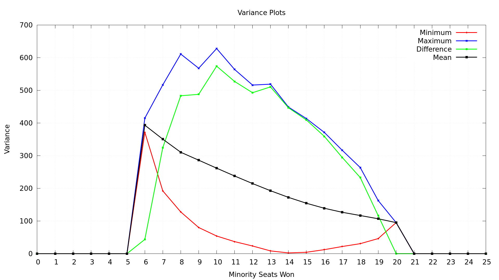
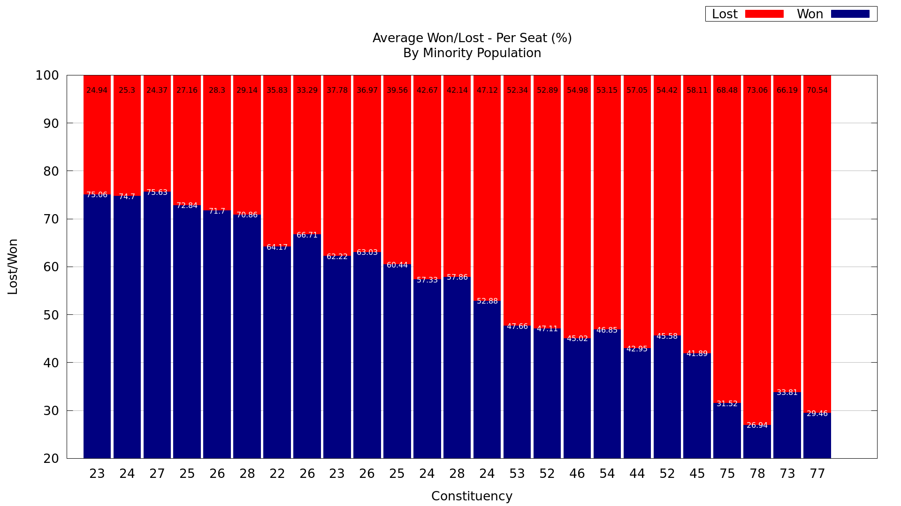
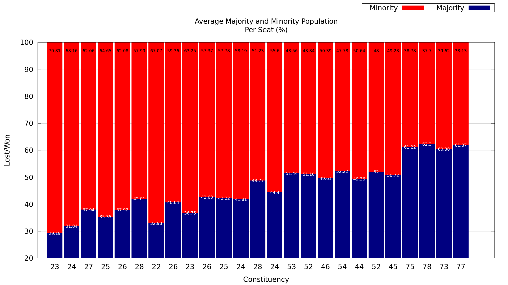
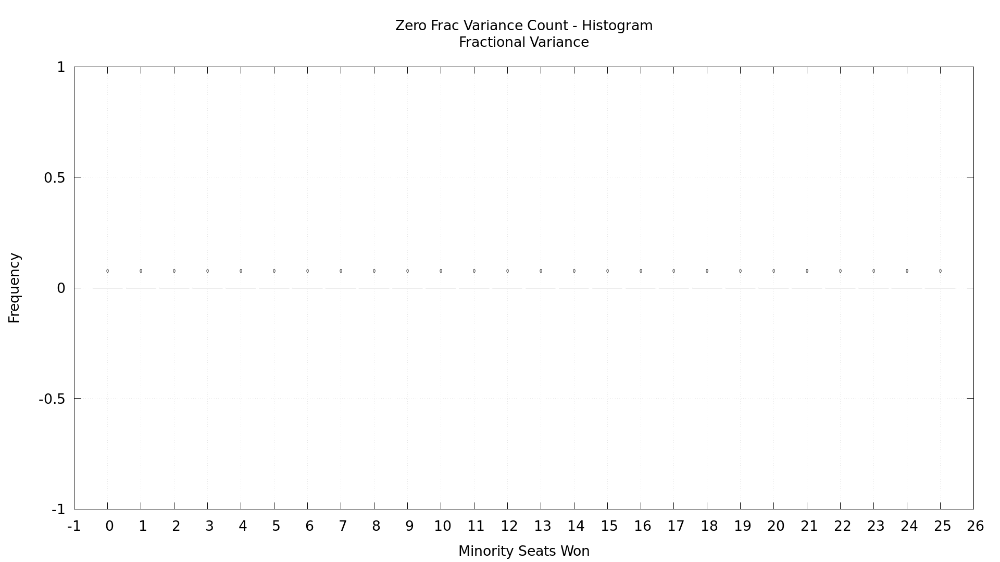
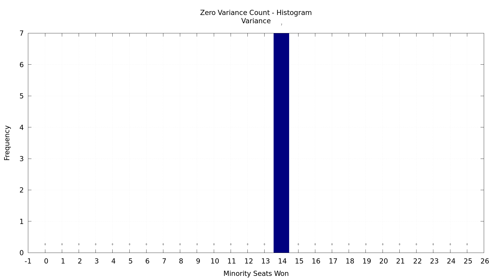

# GM_Var
A Statistical Study of Ghettoisation and Gerrymandering.

Layout of the code:
0. Start
1. Create Filesystem and assign paths
2. According to the set parameters - decide on the total minority population
3. Create different constituencies with the given con_max sistribution
4. Assign Minority population to different constituencies. - Initial Settlement
5. Mix the minority poulations - Migration
6. Conduct Elections * No. of Measurenments
7. Generate configuration files
8. Plot data via launching gnuplot scripts
9. Repeat for iteration if iterations > 1
10. End

Important Points:
+ A unique name has to be parsed in the ARGS. Or the files append to the Parent Path given to the program.
+ The program creates a directory with the provided Run Name
+ Multiple iterations can be performed by changing the parameters - in the iteration block. (Director Name Run_Name_i &#8594; i is the $i^{th}$ iteration)

Different Plots Generated are:

